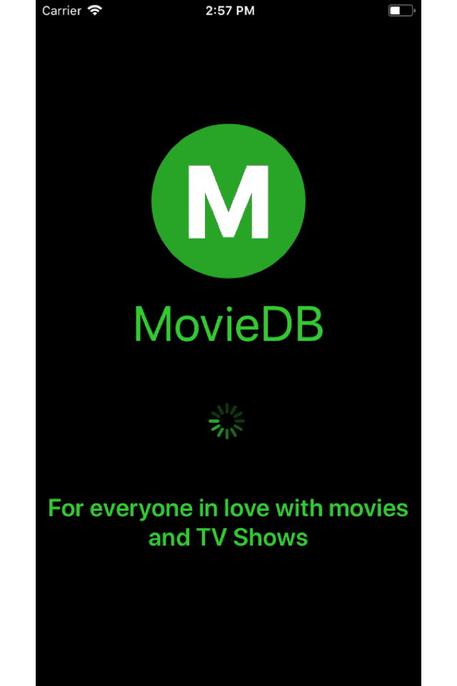

# The Movie DB using React Native

This is cross platform app built with React Native and by using the MovieDB apis. Purpose of this project was to get our hands dirty with React Native and redux, where we just want to focus on application UI development.

### Getting Started

#### Clone the app

```
git clone https://github.com/SandipNirmal/React-Native-MovieDB
```

#### Install Dependancies

```
npm i
```

#### Add Configurations ( one time activity )

Create ```.env``` file in application root similar to ```.env.example```. Replace dummy values present in ```.env.example``` with your values.

```javascript
# MovieDB API key
API_KEY='YOUR_API_KEY'

# Other key value pairs
```

#### Link Dependancies ( one time activity )

``` JavaScript
// link orientation
react-native link react-native-orientation 

// link fonts
react-native link react-native-vector-icons

// link environment variables
react-native link react-native-config

```
#### Run Application

##### iOS Simulator
```
react-native run-ios

npm start
```

##### Android emulator

Start AVD (emulator) before following commands

```
react-native run-android

npm start
```

#### Bundle Application for Device

``` JavaScript
react-native bundle --entry-file index.js --platform ios --dev false --bundle-output ios/main.jsbundle --assets-dest ios
```

#### For iOS

##### Modify AppDelegate.m

``` JavaScript
NSURL *jsCodeLocation;
  jsCodeLocation = [[NSBundle mainBundle] URLForResource:@"main" withExtension:@"jsbundle"];

//  jsCodeLocation = [[RCTBundleURLProvider sharedSettings] jsBundleURLForBundleRoot:@"index.ios" fallbackResource:nil];
```

#### For Android
``` Javascript
 1. Update the alias and the password in the file android/gradle.properties
 2. Run cd android && ./gradlew assembleRelease; cd ..
 3. The Apk should be availabe at android/app/build/outputs/apk/
```

### Screens
<div style="text-align:center">
	
</div>
